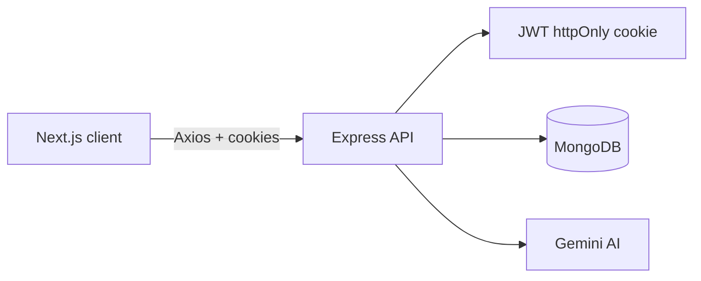

# PrepAI

AI-powered interview preparation SaaS. Track applications, generate role-specific interview questions with Gemini, practice answers, and get structured AI feedback.

## Features

- **Authentication** — Register, login, logout with JWT httpOnly cookies
- **Interview processes** — Track company applications and status
- **Interview rounds** — Organize prep by round (AI Mock / Real)
- **AI question generation** — Difficulty selection (Easy / Medium / Hard / Mixed)
- **Practice flow** — Write answers, get technical + communication scores, missing concepts, and improvements
- **Practice sessions** — Timed multi-question sessions with end summary and weak topics
- **Follow-up questions** — Generate deeper interviewer-style follow-ups per question
- **Question management** — Bookmark, notes, status (`Generated` → `Practiced` → `Completed`)
- **Filtering** — Search, topic, difficulty, status, bookmarks, sort
- **Dashboard** — Completion %, top topics, weak topics, application and round charts
- **Light / dark theme** — System-aware with sun/moon toggle

## Tech stack

| Layer | Stack |
|-------|--------|
| Frontend | Next.js (App Router), TypeScript, Tailwind CSS, shadcn/ui, TanStack Query, React Hook Form, Zod, Axios, Recharts |
| Backend | Node.js, Express, MongoDB, Mongoose, Zod, JWT cookies, Gemini API |

## Architecture



See [docs/architecture.md](docs/architecture.md) for auth flow, API map, schema, and AI integration details.

More docs:

- [API reference](docs/api-reference.md)
- [Database schema](docs/database-schema.md)
- [AI prompts](docs/ai-prompts.md)
- [Launch checklists](docs/launch.md)

## Monorepo layout

```
prepAI/
├── client/          # Next.js frontend
├── server/          # Express API
└── docs/            # Technical documentation
```

## Prerequisites

- Node.js 20+
- MongoDB (local or Atlas)
- Google Gemini API key

## Installation

```bash
# Clone
git clone <your-repo-url>
cd prepAI

# Backend
cd server
npm install
cp .env.example .env   # then fill values

# Frontend
cd ../client
npm install
cp .env.example .env.local   # then fill values
```

## Environment variables

### Server (`server/.env`)

| Variable | Description |
|----------|-------------|
| `PORT` | API port (default `8080`) |
| `MONGO_URI` | MongoDB connection string |
| `JWT_SECRET` | Secret for signing JWTs |
| `CLIENT_URL` | Frontend origin for CORS (e.g. `http://localhost:3000`) |
| `GEMINI_API_KEY` | Google Gemini API key |
| `GEMINI_MODEL` | Model id (e.g. `gemini-2.0-flash`) |
| `NODE_ENV` | `development` or `production` |

### Client (`client/.env.local`)

| Variable | Description |
|----------|-------------|
| `NEXT_PUBLIC_API_URL` | API base URL including `/api` (e.g. `http://localhost:8080/api`) |

## Running locally

```bash
# Terminal 1 — API
cd server
npm run dev

# Terminal 2 — Web
cd client
npm run dev
```

- App: [http://localhost:3000](http://localhost:3000)
- API: [http://localhost:8080](http://localhost:8080)

## Demo data

Seed a recruiter-ready demo account (local/staging only):

```bash
cd server
npm run seed:demo
```

| Field | Value |
|-------|--------|
| Email | `testuser@yopmail.com` |
| Password | `DemoPass123!` |

Includes sample processes, questions, answers, and scores for dashboard charts.

## Deployment

1. Deploy MongoDB (Atlas recommended).
2. Deploy the Express API (Render, Railway, Fly.io, etc.) with production env vars. Set `CLIENT_URL` to your frontend origin and `NODE_ENV=production` so auth cookies use `Secure`.
3. Deploy the Next.js client (Vercel recommended). Set `NEXT_PUBLIC_API_URL` to your API `/api` URL.
4. Ensure CORS credentials and cookie `sameSite`/`secure` match your HTTPS setup.
5. Walk through [docs/launch.md](docs/launch.md) checklists before public launch.

## Development conventions

- **Server state:** TanStack Query
- **Auth tokens:** httpOnly cookies only
- **Forms:** React Hook Form + Zod
- **API client:** Axios services under `client/services/`
- **Backend layers:** Controllers → Services → Models

## License

ISC
