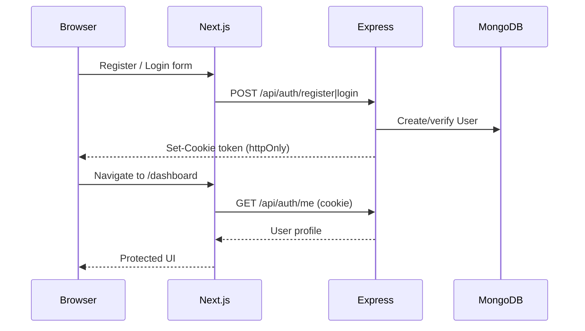
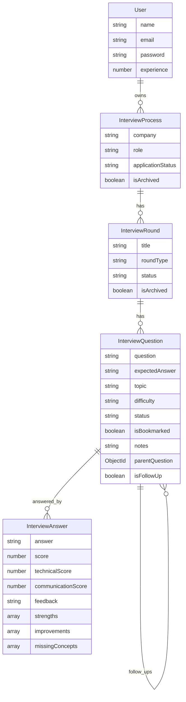
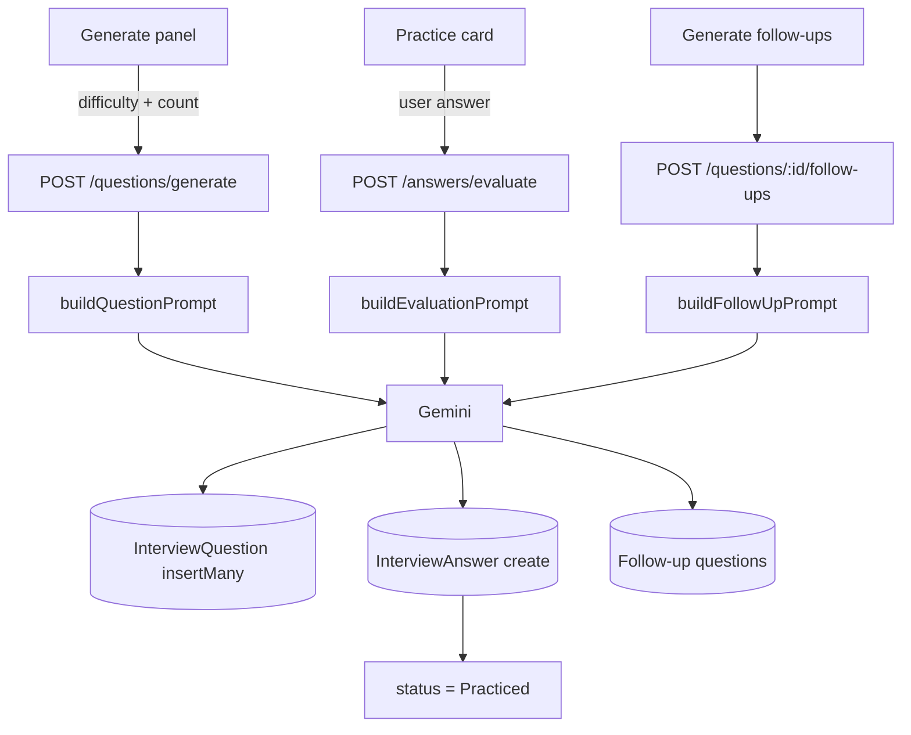

# PrepAI Architecture

Technical reference for the PrepAI v1.1 codebase.

## Folder structure

```
client/
  app/                 # Next.js App Router pages
  components/          # UI by domain (auth, interview-*, dashboard, layout, shared, ui)
  hooks/               # TanStack Query hooks
  services/            # Axios API clients
  types/               # Shared TypeScript types
  lib/validations/     # Client Zod schemas
  providers/           # QueryProvider, ThemeProvider

server/
  src/
    controllers/       # HTTP handlers
    models/            # Mongoose schemas
    routes/            # Express routers
    validations/       # Server Zod schemas
    middleware/        # auth, validate, rateLimit, error
    utils/             # helpers (cookies, tokens, ownership)
  services/
    ai.service.js      # Gemini prompts + generate / evaluate / follow-ups
```

## Authentication flow



- JWT is signed with `JWT_SECRET`, stored in cookie `token` (`httpOnly`, `sameSite=lax`, `secure` in production).
- Frontend uses Axios `withCredentials: true`.
- `ProtectedRoute` gates authenticated pages via `useCurrentUser` → `GET /auth/me`.
- No localStorage tokens, no Redux/Zustand auth store.

## API architecture

Base path: `/api`

| Method | Path | Notes |
|--------|------|-------|
| POST | `/auth/register` | Public |
| POST | `/auth/login` | Public |
| POST | `/auth/logout` | Clears cookie |
| GET | `/auth/me` | Auth required |
| CRUD | `/processes` | Soft-delete via archive |
| CRUD | `/rounds` | Soft-delete via archive |
| POST | `/questions/generate` | AI, rate-limited |
| GET | `/questions/:roundId` | Query: topic, difficulty, status, bookmarked, search, sort, order |
| PATCH | `/questions/:id` | Bookmark, notes, status |
| POST | `/questions/:id/follow-ups` | AI, rate-limited |
| POST | `/answers/evaluate` | AI, rate-limited |
| GET | `/answers/question/:questionId` | Latest answer for question |
| GET | `/dashboard` | Aggregated analytics |

Request pipeline: `helmet` → `cors` → `json` → `cookieParser` → routes (`auth` → optional `rateLimit` → `validate` → controller) → `errorMiddleware`.

## Database schema



### Question status lifecycle

```
Generated → Practiced (on successful evaluate) → Completed (user marks done)
```

Follow-ups are stored as `InterviewQuestion` rows with `isFollowUp: true` and `parentQuestion` set.

## AI integration flow



- Model and key come from `GEMINI_MODEL` / `GEMINI_API_KEY`.
- Responses request `application/json` MIME type.
- AI routes are rate-limited (10 requests / minute / IP).

## Frontend data layer decisions

| Concern | Choice | Why |
|---------|--------|-----|
| Server state | TanStack Query | Cache, invalidation, loading/error without global stores |
| Forms | RHF + Zod | Aligns with server Zod validation |
| HTTP | Axios services | Central `withCredentials`, typed payloads |
| UI | shadcn/ui + Tailwind | Consistent design system, dark mode tokens |
| Theme | next-themes | Class-based `.dark` matching CSS variables |

## Security notes

- Passwords hashed with bcrypt.
- Ownership checks walk `User → Process → Round → Question`.
- Soft deletes (`isArchived`) preserve history.
- Helmet sets secure headers; CORS is origin-locked to `CLIENT_URL`.
