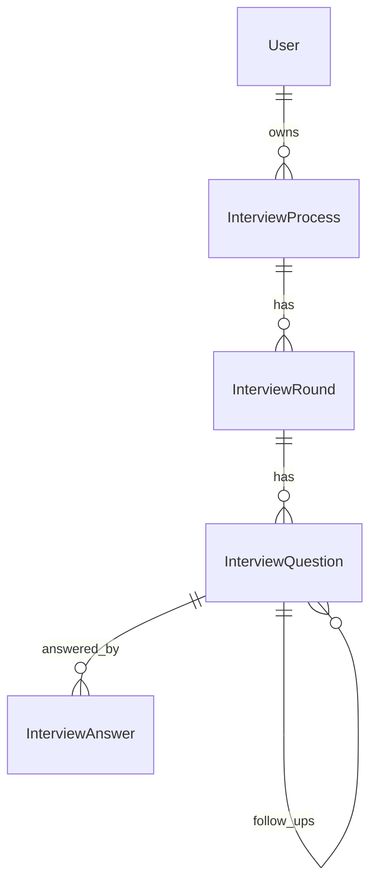

# Database schema

MongoDB collections via Mongoose.

## User

| Field | Type | Notes |
|-------|------|-------|
| name | String | |
| email | String | unique index |
| password | String | bcrypt hash |
| experience | Number | years |
| targetRole | String | optional |
| avatar | String | optional |

## InterviewProcess

| Field | Type | Notes |
|-------|------|-------|
| user | ObjectId → User | |
| company, role | String | required |
| applicationStatus | Enum | Applied…Withdrawn |
| recruiter, jobUrl, notes | String | optional |
| appliedDate | Date | |
| isArchived | Boolean | soft delete |

**Indexes**

- `{ user: 1, isArchived: 1, createdAt: -1 }` — owner lists + sort
- `{ user: 1, isArchived: 1, applicationStatus: 1 }` — status filters / dashboard

## InterviewRound

| Field | Type | Notes |
|-------|------|-------|
| interviewProcess | ObjectId | |
| title | String | |
| roundType | `AI Mock` \| `Real` | |
| status | Upcoming \| Completed \| Cancelled | |
| scheduledAt, score, feedback, notes | optional | |
| isArchived | Boolean | |

**Indexes**

- `{ interviewProcess: 1, isArchived: 1 }` — rounds by process / dashboard `$in`

## InterviewQuestion

| Field | Type | Notes |
|-------|------|-------|
| interviewRound | ObjectId | |
| question, expectedAnswer, topic | String | |
| difficulty | Easy \| Medium \| Hard | |
| order | Number | |
| status | Generated \| Practiced \| Completed | |
| isAnswered, isBookmarked, isFollowUp, isArchived | Boolean | |
| notes | String | |
| parentQuestion | ObjectId \| null | follow-up link |

**Indexes**

- `{ interviewRound: 1, order: 1 }`
- `{ parentQuestion: 1 }`
- `{ interviewRound: 1, isArchived: 1, isFollowUp: 1 }`
- `{ interviewRound: 1, status: 1 }`
- `{ interviewRound: 1, topic: 1 }`
- `{ interviewRound: 1, isBookmarked: 1 }`

## InterviewAnswer

| Field | Type | Notes |
|-------|------|-------|
| user | ObjectId | |
| interviewQuestion | ObjectId | |
| answer | String | |
| score, technicalScore, communicationScore | Number 0–10 | |
| feedback | String | |
| strengths, improvements, missingConcepts | [String] | |
| isArchived | Boolean | |

**Indexes**

- `{ user: 1, interviewQuestion: 1 }` — latest answer lookup (non-unique; re-evaluate allowed)
- `{ user: 1, isArchived: 1 }` — dashboard aggregates
